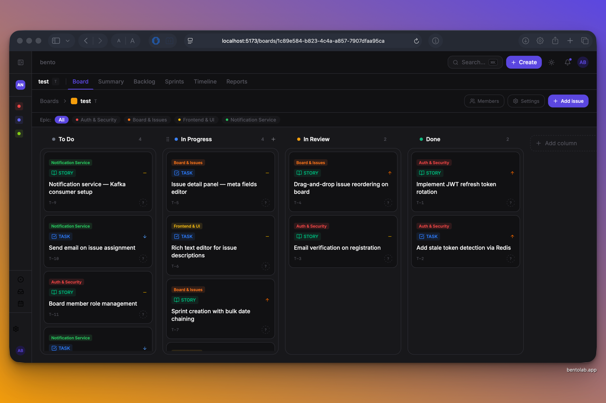
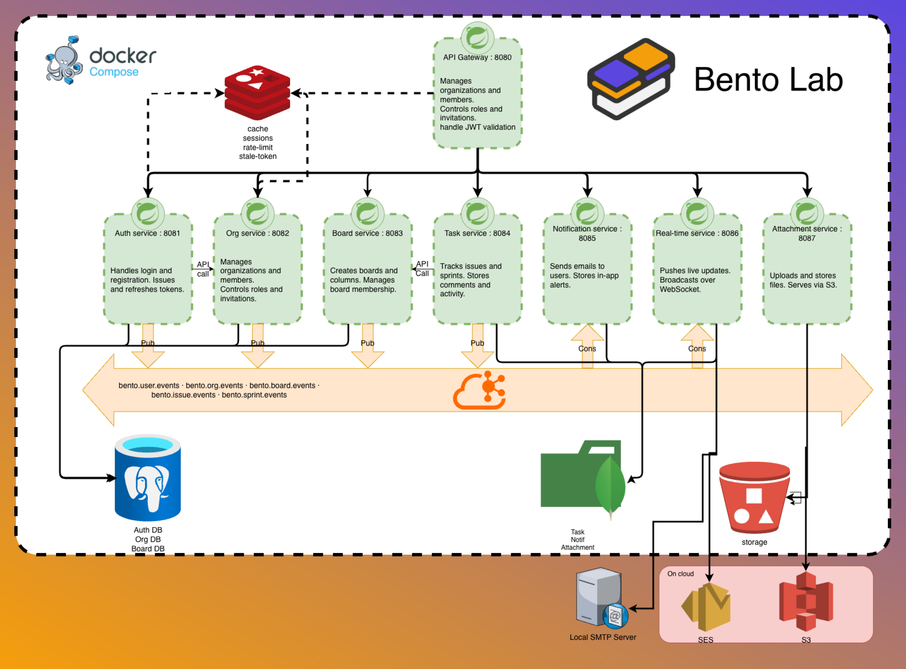

<p align="center">
  
</p>

<p align="center">
  
  
  
  
  
  
  
</p>

<p align="center">
  <strong>Open-source project management — simple enough for a classroom, powerful enough for a real team.</strong><br/>
  Runs anywhere from a Raspberry Pi to the cloud.
</p>

---

## 🚀 Quick Start

```bash
git clone https://github.com/andreibel/bentolab.git
cd bentolab
cp .env.example .env
docker compose up -d
```

Open **http://localhost:3000** and you're in. That's it.

---

## 📸 Screenshot

<p align="center">
  
</p>

---

## 🏗️ Architecture

<p align="center">
  
</p>

| Service | Port | Responsibility |
|---|---|---|
| API Gateway | 8080 | JWT validation, rate limiting, routing |
| Auth Service | 8081 | Login, registration, token refresh |
| Org Service | 8082 | Organizations, members, roles |
| Board Service | 8083 | Boards, columns, membership |
| Task Service | 8084 | Issues, sprints, comments |
| Notification Service | 8085 | Email, in-app alerts |
| Realtime Service | 8086 | Live updates via WebSocket |
| Attachment Service | 8087 | File uploads via S3 |

---

## ⚙️ Configuration

Copy `.env.example` and fill in your values:

```env
# Database
POSTGRES_PASSWORD=your_password
MONGO_PASSWORD=your_password

# Auth
JWT_SECRET=your_secret_key_min_32_chars

# Storage — 'local' or 'aws'
STORAGE_PROVIDER=local

# Email — 'smtp' or 'ses'
MAIL_PROVIDER=smtp
```

For AWS deployment, set `STORAGE_PROVIDER=aws` and fill in:

```env
AWS_ACCESS_KEY=
AWS_SECRET_KEY=
AWS_REGION=
S3_BUCKET=
```

---

## 🧪 Testing

```bash
# Run all tests
./gradlew test

# Auth service — 180 tests, full coverage
./gradlew :services:auth-service:test

# With coverage report
./gradlew :services:auth-service:test jacocoTestReport
```

---

## 🙏 Contributing

1. Fork the repo
2. Create a branch: `git checkout -b feature/your-feature`
3. Commit: `git commit -m 'feat: your feature'`
4. Push and open a Pull Request

---

<p align="center">
  <br/>
  <sub>Built by <a href="https://github.com/andreibel">Andrei Beloziorov</a></sub>
</p>