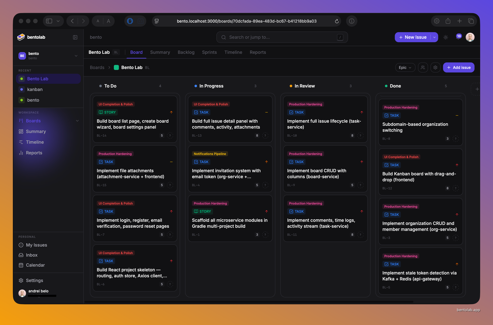
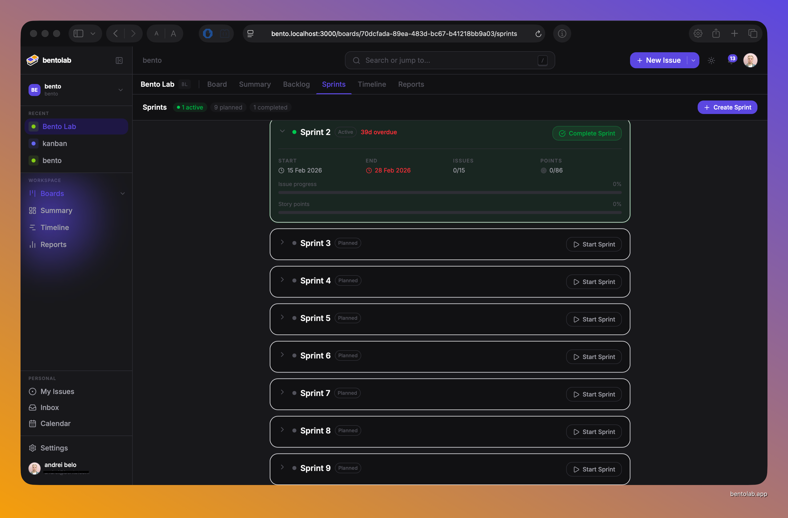
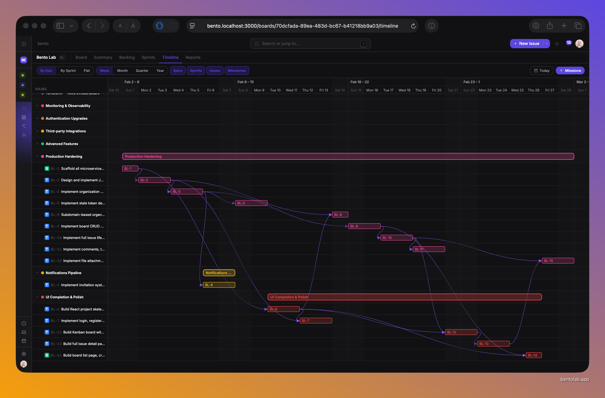

<p align="center">
  
</p>

<p align="center">
  
  
  
  
  
  
</p>

<p align="center">
  <strong>Open-source project management — simple enough for a classroom, powerful enough for a real team.</strong><br/>
  Runs anywhere from a Raspberry Pi to the cloud.
</p>

---

## Screenshots

### Scrum Board

<p align="center">
  
</p>

### Sprint Planning

<p align="center">
  
</p>

### Timeline — Gantt Chart

<p align="center">
  
</p>

---

## Architecture

<p align="center">
  
</p>

| Service | Port | Responsibility |
|---|---|---|
| API Gateway | 8080 | JWT validation, rate limiting, routing |
| Auth Service | 8081 | Login, registration, token refresh, email verification |
| Org Service | 8082 | Organizations, members, roles |
| Board Service | 8083 | Boards, columns, labels |
| Task Service | 8084 | Issues, sprints, comments |
| Notification Service | 8085 | Email, in-app, Discord alerts |
| Realtime Service | 8086 | Live board updates via WebSocket/STOMP |
| Attachment Service | 8087 | File uploads via MinIO |

**Infrastructure:** PostgreSQL 17 · MongoDB 8 · Redis 7 · Kafka 3 (KRaft)

---

## Tech Stack

- **Backend:** Spring Boot 4.0, Java 25, Gradle 9
- **Frontend:** React 19, Vite, TypeScript, TailwindCSS
- **Realtime:** WebSocket / STOMP
- **Storage:** MinIO (S3-compatible)
- **Messaging:** Apache Kafka 3 (KRaft, no ZooKeeper)


---

## Deploy the Beta

No build tools or source code required. All images are pre-built for **linux/amd64** and **linux/arm64** on Docker Hub.

### 1. Download the compose file

```bash
curl -O https://raw.githubusercontent.com/andreibel/bentolab/main/docker-compose.beta.yml
curl -O https://raw.githubusercontent.com/andreibel/bentolab/main/.env.example

```

### 2. Configure secrets

```bash
cp .env.example .env
```

Open `.env` and fill in every value. The three security secrets must be unique random strings — generate them with:

```bash
openssl rand -base64 32
```

Minimum required changes from the example:

| Variable | What it is |
|---|---|
| `JWT_SECRET` | Signs all auth tokens — keep private |
| `GATEWAY_INTERNAL_SECRET` | Shared secret between gateway and services |
| `AUTH_PEPPER` | Extra entropy added to password hashes |
| `POSTGRES_PASSWORD` | PostgreSQL password |
| `MONGO_PASSWORD` | MongoDB password |
| `MINIO_ROOT_PASSWORD` | MinIO (file storage) password |
| `FRONTEND_URL` | Public URL users reach the app at (used in email links) |
| `MAIL_FROM` | From address on verification / reset emails |

### 3. Start everything

```bash
docker compose -f docker-compose.beta.yml up -d
```

Docker pulls ~12 images on the first run. Once all containers are healthy:

| URL | What it is |
|---|---|
| `http://localhost:3000` | The app |
| `http://localhost:8025` | MailHog — catches all outbound emails in dev |
| `http://localhost:9001` | MinIO console — browse uploaded files |

### 4. Updating to a new build

When a new version is released, update the image tags in `docker-compose.beta.yml` and pull:

```bash
docker compose -f docker-compose.beta.yml pull
docker compose -f docker-compose.beta.yml up -d
```

Current version: **v0.1.1-beta-4**

Data volumes are preserved across updates.

### 5. Stopping

```bash
# Stop containers, keep data
docker compose -f docker-compose.beta.yml down

# Stop and delete all data (full reset)
docker compose -f docker-compose.beta.yml down -v
```

---

## Building from Source

```bash
git clone https://github.com/andreibel/bentolab.git
cd bento

# Start with local builds instead of Hub images
docker compose up -d --build
```

Requirements: Java 25, Docker with Compose v2.

```bash
# Run tests
cd backend && ./gradlew test

# Run a single service (dev mode)
./gradlew :services:auth-service:bootRun --args='--spring.profiles.active=dev'
```

---

## Contributing

1. Fork the repo
2. Create a branch: `git checkout -b feature/your-feature`
3. Commit: `git commit -m 'feat: your feature'`
4. Push and open a Pull Request

---

<p align="center">
  <sub>Built by <a href="https://github.com/andreibel">Andrei Beloziorov</a> · AGPL-3.0</sub>
</p>
